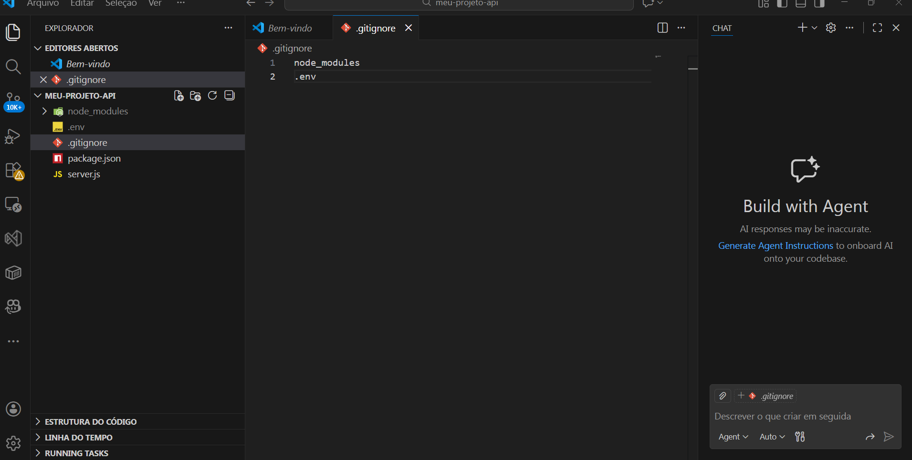
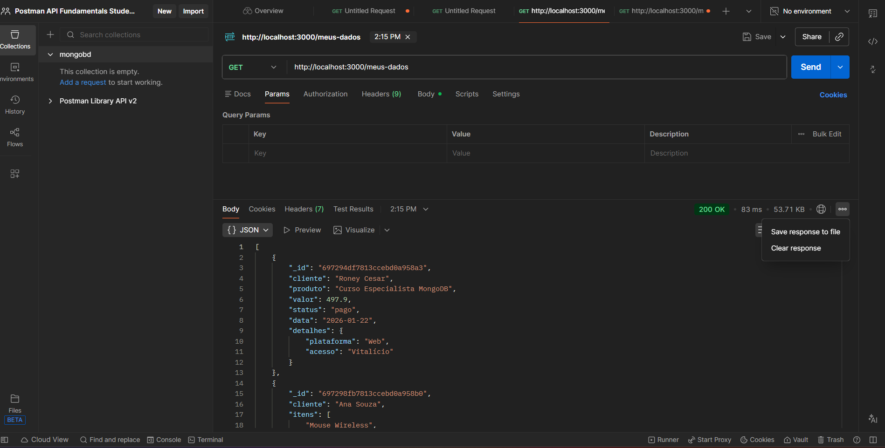
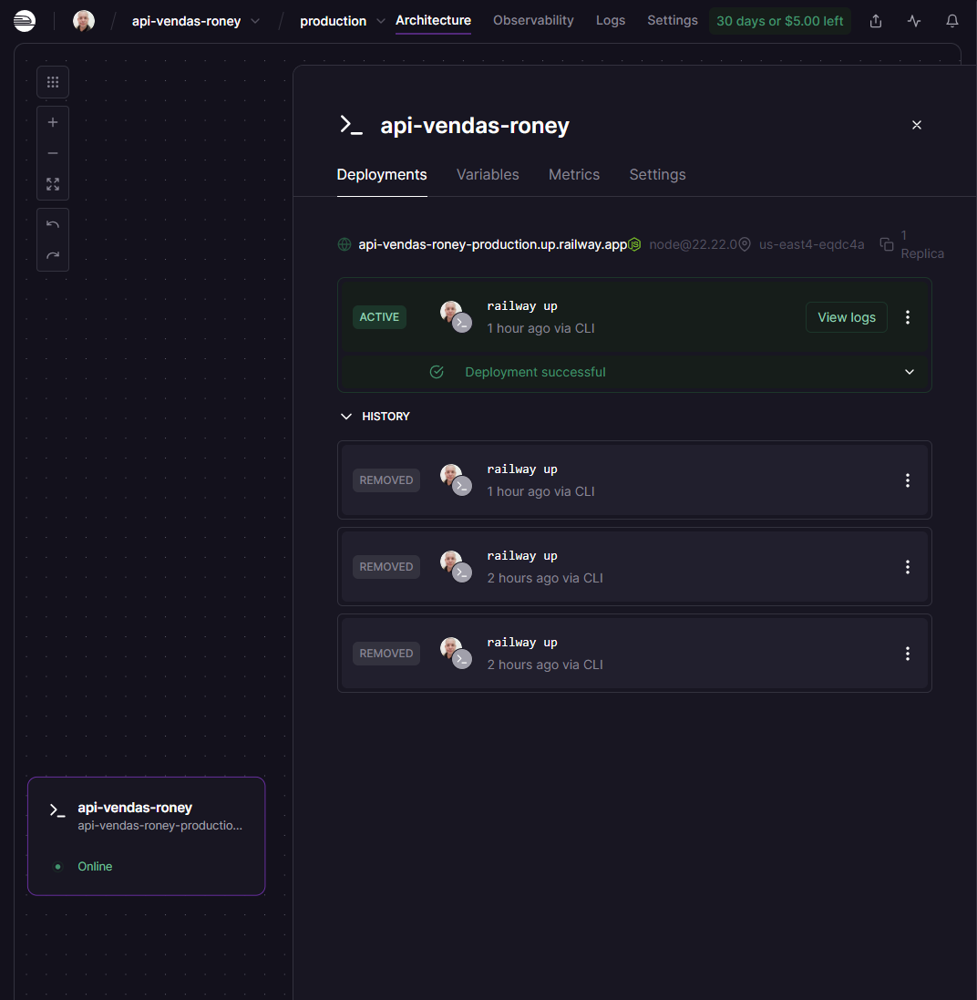
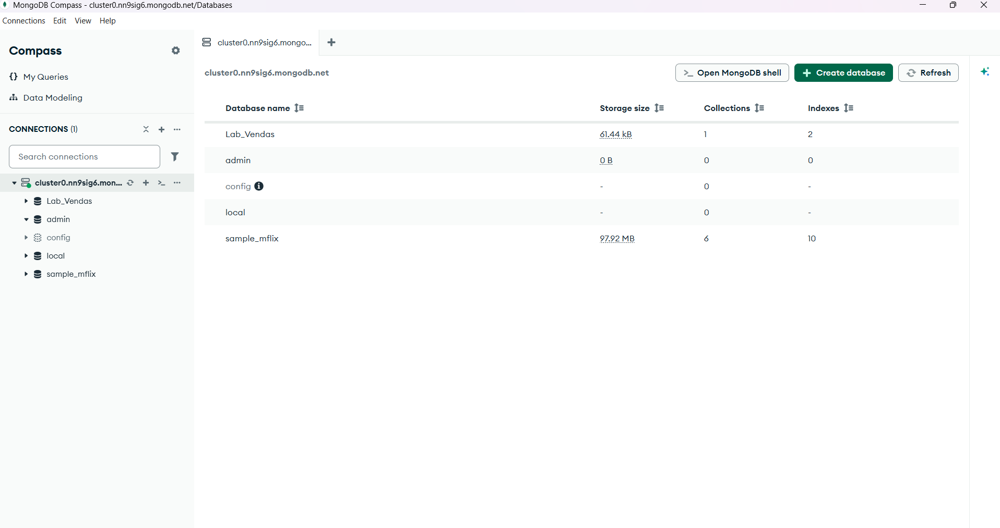
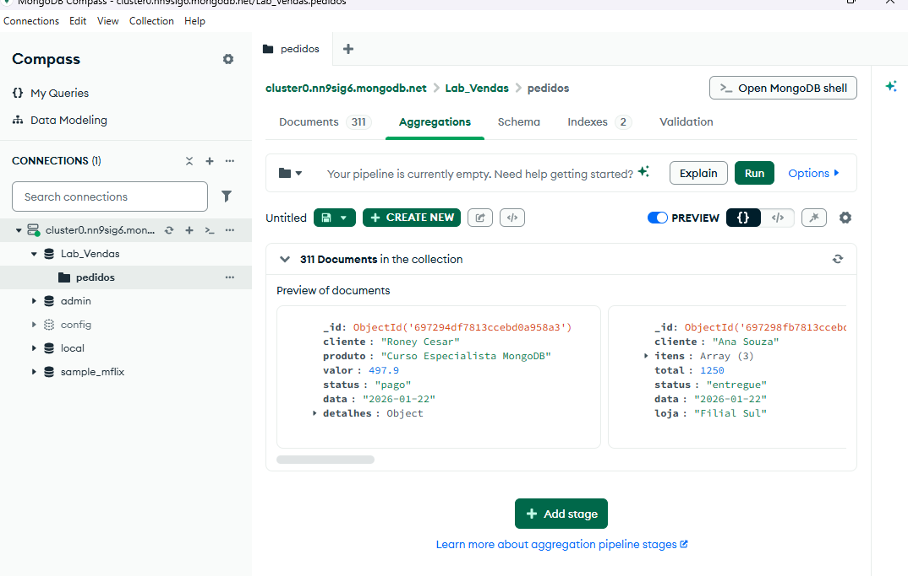

# 📦 Fullstack Data API
> **Pipeline completo de engenharia de dados, cobrindo ETL, Data Quality, API REST e Deploy em Cloud.**

Este projeto apresenta, de forma prática e aplicada, todo o ciclo de vida de dados corporativos: desde a ingestão de dados brutos (**RAW**), passando pelo processamento, limpeza e padronização (**Data Quality / CURATED**), até a disponibilização desses dados através de uma **API REST escalável** em ambiente de nuvem (**Cloud**).  

O objetivo é demonstrar como transformar informações inconsistentes e não estruturadas em **dados confiáveis, estruturados e prontos para consumo**, permitindo que aplicações de negócio possam **acessar, analisar e utilizar os dados de forma segura e eficiente**.  

Além disso, o projeto enfatiza boas práticas de engenharia de dados, incluindo:
- Tratamento e normalização de dados financeiros e de datas;  
- Automação de pipelines de ETL com Node.js;  
- Testes e validação de endpoints via Postman;  
- Deploy automatizado em Cloud (Railway), com configuração de variáveis de ambiente e CI/CD.

Com isso, o projeto não apenas exemplifica **técnicas de manipulação de dados**, mas também reforça habilidades de **integração entre desenvolvimento, dados e infraestrutura em nuvem**, essenciais para cenários reais de mercado.

---

## 🎯 Objetivo do Projeto

Construir uma infraestrutura completa de dados ponta a ponta, simulando cenários reais do mercado, com foco em **qualidade, escalabilidade e automação**.  

O projeto aborda as seguintes etapas críticas:
- **Ingestão:** Coleta e processamento de dados inconsistentes e não padronizados, garantindo que todos os registros possam ser utilizados no pipeline.  
- **Transformação (ETL):** Limpeza, padronização e normalização dos dados, incluindo tratamento de valores financeiros, datas e campos nulos, para criar dados confiáveis e estruturados.  
- **Persistência:** Armazenamento seguro e eficiente em banco de dados NoSQL (MongoDB Atlas), utilizando documentos e collections para suportar consultas complexas.  
- **Entrega:** Exposição dos dados através de uma **API REST escalável**, permitindo que aplicações e usuários acessem informações tratadas de forma confiável e em tempo real.

---
## 🟢 Etapas do Projeto

🟢 **Fase 1 – MongoDB:** Configuração do cluster, Collections, Connection String, firewall.  
🟡 **Fase 2 – ETL e Limpeza:** Regex para remover símbolos, conversão de tipos, CSV → JSON.  
🔵 **Fase 3 – Validação com Postman:** Teste de requests, Status Codes 201/200, dados confirmados no cluster.  
🟣 **Fase 4 – Deploy e Cloud:** GitHub → Railway CI/CD, variáveis de ambiente, link público para API.  

---

## 🧱 Estrutura do Projeto

```text
 📦 fullstack-data-api
┣ 📂 data
┃ ┣ 📂 raw
┃ ┃ ┗ vendas_raw.csv
┃ ┣ 📂 curated
┃ ┃ ┗ vendas_curated.csv
┃ ┗ 📄 README.md
┣ 📂 img
┃ ┗ (prints do MongoDB, Postman e Deploy)
┣ 📂 src
┃ ┗ etl.js
┣ 📄 server.js
┣ 📄 package.json
┣ 📄 .gitignore
┗ 📄 README.md
```

## 📊 Camada de Dados e Persistência NoSQL

Esta seção detalha como os dados são armazenados, tratados e disponibilizados para consumo via API, mostrando a evolução do pipeline de ETL desde os arquivos brutos (**RAW**) até os dados confiáveis (**CURATED**) no MongoDB Atlas.

### 📥 Download dos Dados

Você pode baixar os arquivos gerados pelo pipeline para acompanhar a evolução dos dados:

🔴 **Dados Brutos (RAW)**  
[⬇️ Download vendas_raw.csv](raw/vendas_raw.csv)  
_Este arquivo contém os dados originais, com inconsistências, símbolos monetários (`R$`), datas no padrão brasileiro e possíveis erros de digitação._

🟢 **Dados Tratados (CURATED)**  
[⬇️ Download vendas_curated.json](curated/vendas_curated.json)  
_Este arquivo contém dados limpos, padronizados e tipados, prontos para análise e consumo via API._

---

### 🔴 Dados RAW (Sujo)

Esses dados representam o **estado original** antes do processamento. São úteis para auditoria e estudo da evolução do pipeline, mas **não devem ser usados diretamente** em análises ou aplicações.

**Características dos dados RAW:**
- Valores monetários inconsistentes (`R$`, `.`, `-`)  
- Datas em múltiplos formatos  
- Campos vazios e nulos  
- Status não padronizados (`Pago`, `pago`, `PENDENTE`, etc.)  
- Erros de digitação (`canceldo`, `entregueu`, etc.)  

---

### 🟢 Dados CURATED (Tratado)

Após o processo de ETL, os dados foram transformados em **documentos consistentes e confiáveis**, ideais para persistência no MongoDB e consumo via API.

**Transformações aplicadas:**
- Conversão de valores monetários para **Number**  
- Normalização de datas no padrão ISO 8601 (`YYYY-MM-DD`)  
- Padronização de status (`PAGO`, `PENDENTE`, `ENTREGUE`, `CANCELADO`)  
- Remoção de registros inválidos ou incompletos  
- Estrutura consistente para fácil consulta e análise  

Esses dados podem ser utilizados diretamente em **análises, dashboards ou aplicações** sem risco de inconsistências.

---

## 🔄 Pipeline ETL

O pipeline ETL (Extract, Transform, Load) é responsável por **transformar os dados brutos (RAW) em dados confiáveis e estruturados (CURATED)**, garantindo que estejam prontos para análise ou consumo via API.

### 1️⃣ Extract (Extração)
- Leitura dos arquivos CSV brutos (`raw`) utilizando Node.js.  
- Coleta e ingestão dos dados originais, mantendo registro completo para auditoria e rastreabilidade.  
- Preparação dos dados para processamento subsequente, garantindo compatibilidade com o pipeline.

### 2️⃣ Transform (Transformação)
- **Limpeza de dados:** remoção de símbolos monetários (`R$`, `.`, `-`) e caracteres especiais indesejados.  
- **Conversão de tipos:** transformação de strings numéricas em valores do tipo `Number` e datas em formato ISO (`YYYY-MM-DD`).  
- **Padronização de texto:** unificação de campos como status (`PAGO`, `PENDENTE`, `ENTREGUE`, `CANCELADO`).  
- **Normalização de datas:** ajuste de múltiplos formatos encontrados nos dados brutos.  
- **Tratamento de valores ausentes:** preenchimento, substituição ou exclusão de registros incompletos, garantindo consistência e integridade.

### 3️⃣ Load (Carregamento)
- Inserção dos dados tratados na **coleção MongoDB** (`CURATED`).  
- Criação de arquivos JSON padronizados prontos para análise ou consumo via API.  
- Garantia de consistência e integridade, permitindo consultas confiáveis e rápidas no banco de dados.

> Esse pipeline garante que dados originalmente inconsistentes se tornem **documentos estruturados e confiáveis**, permitindo análises precisas e integração segura com sistemas externos.

---
## 🖥️ Script Principal

O script principal (`etl.js`) é o coração do pipeline de dados. Ele automatiza **todo o fluxo de transformação**, garantindo que os dados brutos (**RAW**) sejam convertidos em dados confiáveis (**CURATED**) e prontos para consumo via API.

Principais funções do script:

- **Leitura do CSV bruto:** captura todos os registros originais, mantendo rastreabilidade.  
- **Limpeza e transformação de dados:**  
  - Remoção de símbolos monetários (`R$`, `.`, `-`)  
  - Conversão de strings em números e datas em formato ISO (`YYYY-MM-DD`)  
  - Padronização de campos de status (`PAGO`, `PENDENTE`, `ENTREGUE`, `CANCELADO`)  
  - Tratamento de valores ausentes e registros inválidos  
- **Persistência no MongoDB Atlas:** gravação automática dos documentos tratados na coleção CURATED.  
- **Geração de arquivo JSON:** mantém uma versão externa dos dados tratados para download e análise.

> Esse script garante que o pipeline seja **automático, auditável e escalável**, servindo como base para análises e integração com aplicações externas.

### ❌ Inconsistência de Tipos
- **Problema:** Valores originalmente como strings impediam cálculos, agregações e consultas corretas no MongoDB.  
- **Solução:** Sanitização completa dos dados antes do `insertMany`, convertendo strings em **Number** e datas para formato ISO, garantindo consistência.

### ❌ Falha de Conexão no Deploy
- **Problema:** A API não conseguia se conectar ao MongoDB devido a regras de firewall e restrições de rede.  
- **Solução:** Configuração de **IP Whitelist (`0.0.0.0/0`)** no MongoDB Atlas e uso de **variáveis de ambiente** para conexão segura.

### ❌ App Crash no Startup
- **Problema:** A aplicação travava quando a porta padrão já estava em uso.  
- **Solução:** Implementação de **porta dinâmica** utilizando `process.env.PORT`, permitindo que a aplicação seja iniciada em qualquer ambiente de produção.
---

## ☁️ Deploy & Validação

O projeto foi disponibilizado em ambiente de **produção escalável** utilizando Railway, garantindo que a API esteja sempre acessível e pronta para consumo.

### 1️⃣ Infraestrutura no Railway
- A API está conteinerizada e operando em ambiente de produção, com escalabilidade automática.  
- Configuração de **variáveis de ambiente** para conexão segura ao MongoDB Atlas, evitando exposição de senhas ou informações sensíveis.  

### 2️⃣ Validação via Postman
- Teste de escrita (POST) simulando inserção de registros, por exemplo, para a IBM Brasil.  
- Verificação de **Status Codes** (201 Created, 200 OK) para garantir que a integração entre API e banco de dados esteja funcionando corretamente.  
- Confirmação de persistência dos dados no MongoDB Atlas.

**Resumo da validação:**
- **Infraestrutura:** Railway (PaaS)  
- **Banco de Dados:** MongoDB Atlas (Cloud)  
- **Testes:** Postman, MongoDB Compass  
- **Operações realizadas:** Inserção de novos registros, leitura via endpoint público e persistência confirmada no banco.

> Essa validação garante que a API esteja funcional, segura e pronta para ser consumida por aplicações externas ou usuários finais.

---

## 🚀 Endpoint da API

O projeto disponibiliza os dados tratados via **API REST**, permitindo que aplicações externas ou usuários acessem os dados de forma confiável e em tempo real.

### 🔹 Endpoint Público

- **GET:** `https://api-vendas-roney-production.up.railway.app/meus-dados`  
  Retorna todos os registros da base **CURATED** em formato JSON, prontos para análise ou consumo por sistemas externos.

### 🔹 Possíveis operações adicionais (exemplos)

- **POST:** Inserir novos registros na base de dados (validação de payload e status code 201 Created).  
- **PUT/PATCH:** Atualizar registros existentes (validação de campos e consistência).  
- **DELETE:** Remover registros específicos, mantendo integridade dos dados.

> Com este endpoint, qualquer aplicação ou ferramenta de análise pode acessar os dados **tratados e confiáveis**, integrando facilmente com dashboards, scripts de análise ou sistemas de BI.

---

## 🧰 Stack Tecnológica

Este projeto utiliza tecnologias modernas para construir um pipeline completo de dados, do processamento à entrega via API em nuvem:

- **Runtime:** Node.js – ambiente de execução para scripts de servidor.  
- **Framework:** Express.js – criação de APIs REST escaláveis e eficientes.  
- **Banco de Dados:** MongoDB Atlas – banco NoSQL em nuvem, ideal para documentos e consultas flexíveis.  
- **Deploy:** Railway – PaaS para deploy automático e escalável da API.  
- **Testes e Validação:**  
  - **Postman:** teste de endpoints, validação de payload e status codes.  
  - **MongoDB Compass:** inspeção e validação de dados no cluster.  
  - **GitHub:** versionamento, integração contínua (CI/CD) e controle de histórico do código.  

> Essa stack permite criar um pipeline **robusto, escalável e confiável**, integrando engenharia de dados, API REST e deploy em nuvem.

## 🖼️ Prints e Visualizações

A seguir, imagens que ilustram diferentes etapas do projeto, desde segurança e configuração da API até visualização e validação dos dados no MongoDB Atlas.

<!-- Segurança e Configuração da API -->
<h4>🔹 Segurança e Configuração da API</h4>
<table>
<tr>
<td></td>
<td></td>
<td></td>
</tr>
</table>

<!-- Testes com Postman -->
<h4>🔹 Testes com Postman</h4>
<table>
<tr>
<td></td>
<td></td>
</tr>
</table>

<!-- Deploy e Monitoramento -->
<h4>🔹 Deploy e Monitoramento</h4>
<table>
<tr>
<td></td>
<td></td>
</tr>
</table>

<!-- Visualização no MongoDB Atlas -->
<h4>🔹 Visualização no MongoDB Atlas</h4>
<table>
<tr>
<td></td>
<td></td>
<td></td>
</tr>
<tr>
<td></td>
<td></td>
</tr>
</table>


## 📌 Observações Importantes

- Todos os dados utilizados neste projeto são **fictícios** e servem **exclusivamente para fins educacionais**, garantindo que nenhuma informação sensível ou pessoal real seja armazenada ou processada.  
- O projeto foi desenvolvido com foco em **aprendizado e portfólio**, demonstrando habilidades práticas em diferentes áreas da engenharia de dados e desenvolvimento de software:  
  - **Engenharia de Dados (ETL e Data Quality):** coleta, transformação, limpeza e normalização de dados, convertendo registros brutos em informações confiáveis e estruturadas.  
  - **APIs RESTful:** criação de endpoints escaláveis para consumo seguro e integrado com sistemas externos.  
  - **Deploy em Cloud (Railway):** disponibilização da API em ambiente de produção, com configuração de variáveis de ambiente e práticas de CI/CD.  
- Todas as etapas seguem **boas práticas de desenvolvimento**, incluindo:  
  - Tratamento e padronização de dados inconsistentes  
  - Uso de **variáveis de ambiente** para proteção de credenciais  
  - Versionamento e integração contínua (**CI/CD**) para rastreabilidade e atualizações automáticas  
- Este projeto é ideal para estudo, demonstração de competências técnicas e referência em **projetos acadêmicos ou profissionais**, servindo como exemplo completo de pipeline de dados, API REST e deploy em nuvem.

---

## 👨‍💻 Autor

**Roney Cesar**  
Analista em Desenvolvimento de Sistemas, com foco na integração entre **desenvolvimento de software e engenharia de dados**.  

Este projeto foi desenvolvido como estudo educacional, com ênfase em:  
- **ETL (Extract, Transform, Load)** – processamento e limpeza de dados brutos para geração de informações confiáveis.  
- **APIs RESTful** – criação de endpoints escaláveis para consumo seguro de dados.  
- **Deploy em Cloud (Railway)** – publicação de serviços em produção, com CI/CD e variáveis de ambiente.  

O objetivo é demonstrar competências práticas e fornecer um **exemplo completo de pipeline de dados e API** para portfólio, aprendizado ou referência em projetos acadêmicos e profissionais.

---
